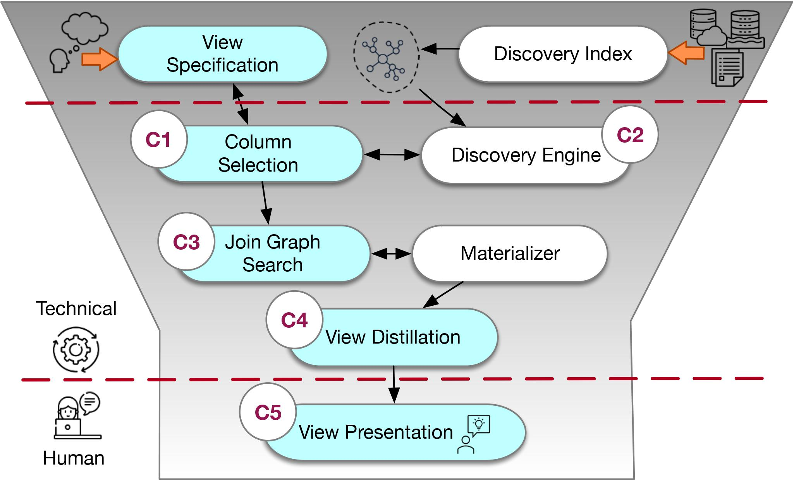

<!--

-->

# Data Discovery Tools and Systems

**[This project is currently a work in progress, and we expect to have all
documentation, test and a full demo done by the end of the ~~2nd quarter of 2023.~~ 1st quarter of 2024]**

Data discovery is the problem of identifying and retrieving data that satisfies
an information need. See [common data discovery problems here](docs/why_ver.md) and feel free to open
issues to suggest other scenarios you know about. This respository contains Ver, a 
collection of tools designed to address data discovery problems. 

Ver is divided into separate components that can be used in isolation to solve
point problems, or used jointly to address discovery scenarios end
to end. Upstream of any pipeline we have data repositories. Downstream of any
pipeline we have an interface. Ver has different interfaces, including a Python
discovery API (Aurum), a view discovery API (we call it Ver as well), and a
utility-function based search (we call it Metam). And we are always thinking of new interfaces
and components to help more users address their discovery needs.

- [Quick Start](docs/quickstart.md)
- [Tutorials](docs/tutorials.md)
- [Contributing](docs/contributing.md)

### Structure of the Repository

WIP

## Ver Overview and Architecture

A conceptual way of understanding what Ver does is to look at its architecture.

     

The picture includes each of Ver's
components. We give a brief description of each component below. Most components can be used in a standalone manner, and if you inspect the component, you will find a component-specific README that gives you more details.

### Discovery Engine and Index Creation

This component builds indices over pathless table collections: i) a join path
index, which can be approximate; ii) retrieval indices over table names, values,
and attribute names and column similarity. The indices are available online, via
the Engine’s API to other components.

### View Specification 

Discovery interfaces include spreadsheet-style, keyword search, APIs, natural
language, and combinations of these. The reference architecture supports these
interfaces via this component. For QBE-based interfaces, as implemented by Ver,
the input is a set of examples, and the output of this stage is a set of example
attributes and values. 

### Column Selection

This component selects the subset of tables containing user-provided examples.
The output of this component is a collection of candidate tables and columns.

### Join Graph Search

Given a set of candidate tables, an input query, and the discovery index
providing join paths, this component identifies all join graphs that, when
materialized, produce candidate PJ-views.  The main goal of this component is to
address the large join path space.  To materialize candidate PJ-views, this
component uses a Materializer, a data processing component with the capacity to
execute PJ queries.

### View Distillation 

This component computes categories from the candidate PJ-views that include
redundancy and containment in the views, as well as opportunities for unioning
views and more. Some categories can be used to distill/summarize the views.
Others are shared with the downstream component.

### View Presentation 

This component uses different question interfaces to elicit information from
users via data questions. The questions are designed to narrow down the space
until users find the desired view. The component chooses what questions to ask,
sequentially, using a bandit-based approach.

