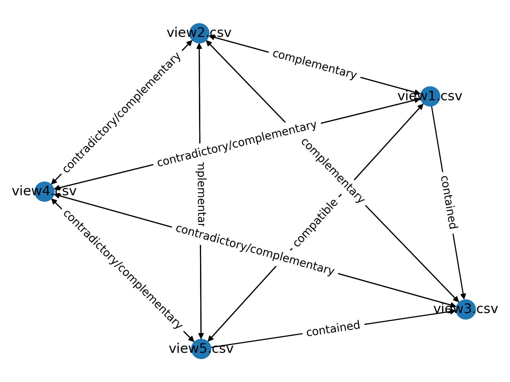
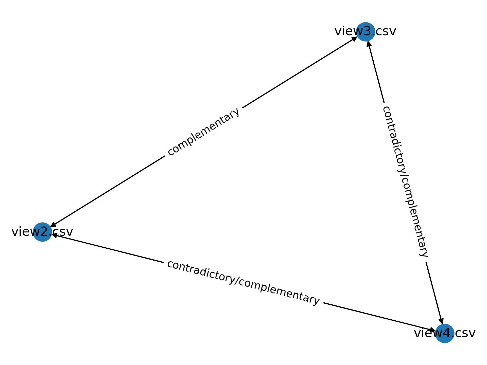

# View Distillation

## Input

`path_to_views`: path to the directory containing views in csv format 

or

`dfs`: a list of dataframes. The module will assign a view name to each dataframe for easier access.
  
## Create an instance

```python
from view_distillation import ViewDistillation

vd = ViewDistillation(path_to_views, dfs)
```

## High-level APIs

### Get current views

```python
vd.get_current_views()
```

This will return the list of current views (file names). Views that were pruned from any previous API calls will be excluded.

You can call `get_df(view)` or `get_dfs(views)` to obtain the corresponding dataframe(s).

### Distill views

```python
vd.distill_views(remove_identical_views=True, 
                 remove_contained_views=True,
                 union_complementary_views=True)
```

If `remove_identical_views` is `True`, it will find all views that are identical with
each other, keep one of the view and remove the rest.

If `remove_contained_views` is `True`, it will find all views that are contained in some larger view
and remove them.

If `union_complementary_views` is `True`, it will union each pair of complementary views that *do not have any contradictions with any other views on any key* since the contradictions cannot be resolved automatically,
and materialize the new view in the input directory.
The complementary views used to union are removed.

This API will return the list of views left after distillation.

### Interactive tool for choosing among contradictory views

Works in Jupyter notebook with Jupyter Widgets installed.

```jupyterpython
%gui asyncio

task = vd.present_contradictory_views_demo()

await task

views_pruned, views_selected, views_left = task.result()
```

After you exit, it will return the views you have pruned, selected, 
and current views left.

## Low-level APIs

### Find compatible views

```python
vd.find_compatible_views()
```

This will return a list of lists, each inner list contains the views that are identical to each other.

### Prune compatible views

```python
vd.reduce_compatible_views_to_one()
```

This will prune all compatible views and leave one, any future API calls will operate on the rest of views.
It will also return the list of views left after pruning.

### Find contained views

```python
vd.find_contained_views()
```

[//]: # (This will return a list of lists, each inner list contains views in sorted order &#40;descending by view size&#41; where each view contains all the views that are smaller.)
This will return a `dict`, where the key is a view and the value is the set of views that are contained in the key view. 

### Prune contained views

```python
vd.prune_contained_views(keep_largest=True)
```

If the parameter `keep_largest` is True, it will prune all contained views and only keep the largest view in each group, 
any future API calls will operate on the rest of views. It will also return the list of views left after pruning.

(note: we may want to allow different pruning strategies that users can set)

### Find contradictory views

```python
vd.find_contradictory_views()
```

This will return a `dict` of `dict`. The outer key is a tuple `(view1, view2)`, and the corresponding `dict`'s inner
key is the `key` column, and the corresponding value is a set of key values where `view1` and `view2` contradict on. 
The `key` is a `tuple` since it can be a composite key containing more than one attributes, and each key value is also a `tuple`.

For example, if the `key` is the `id` column in `view1` and `view2`, and the key value is `123`, this means
`view1` and `view2` both contains the row with `id = 123` but the rest of values in the row differ.

### Find complementary views

```python
vd.find_complementary_views()
```

[//]: # (This will return a list of tuples. Each tuple `&#40;view1, view2, key&#41;` means `view1` and `view2` are complementary on `key`,)
[//]: # (in other words, `view1` and `view2` don't have any contradictions on `key`.)

This return a `dict`, where the key is a tuple `(view1, view2)`, and the corresponding value is the set of key columns on which
`view1` and `view2` are complementary.

### Union complementary views

```python
vd.union_complementary_views()
```

This will find union each pair of complementary views that *do not have any contradictions with any other views on any key*,
and materialize the new view in the input directory.
The complementary views used to union are removed.


## Helper Functions

### Get Dataframe

```python
vd.get_df(view)
```

Get the corresponding Dataframe from the given `view` path.


### Get Dataframes

```python
vd.get_dfs(views)
```

Get the list of Dataframes from a list of views paths.


### Get row from key

```python
vd.get_row_from_key(df, key, key_value)
```
 
The input are `df`, a pandas Dataframe where the row will be extracted,
`key`, the key column name, it should be a `tuple` since 
the key can be composite and contain multiple columns,
and `key_value`, the corresponding key value, also a `tuple`.

This will return the row as a Dataframe based on the provided `key` and `key_value` in `df`.

## Graph

### Generate Graph

```python
vd.generate_graph()
```
Gnerates a `networkx` `Digraph` and returns the graph. Each node is a view, and each edge denotes the 4C
relationship between the two views, labeled as `c`. 
`c` can be `compatible`, `contained`, `contradictory`, `complementary`, or `contradictory/complementary`; the last one denotes
when the two views are contradictory on some key, but complementary on some other key. All the labeled edges are bi-directional, except for `contained`, in which case view1 -> view2 means view1 is contained in view2.

When the edge labels as `contradictory`, there wil be an associated `contradictory_key_values` attribute, which is a `dict` where the key is the key column (a tuple), and the corresponding value is the set of contradictory key values (also tuples).

When the edge is labels as `complementary`, there will be an associated `complementary_keys` attribute, which is the set of key columns where the views are complementary on.

If it is labels as `contradictory/complementary`, both attributes will exist.

Example graph:



### Prune Graph

```python
vd.prune_graph(remove_identical_views=True, 
               remove_contained_views=True,
               union_complementary_views=True)
```

Similar functionality as `distill_views`, and returns the pruned graph. 
The nodes and edges will be pruned based on the given options, and unioned complementary views will be added to the graph as new nodes.

Pruned graph:



## Get attributes

```python
vd.get_attributes(path_to_view_1, path_to_view_2)
```

This returns a `dict` of attributes associated with the edge from view1 to view2. 
The `dict` includes `c`, and optionally `contradictory_key_values` and `complementary_keys` if exist.
